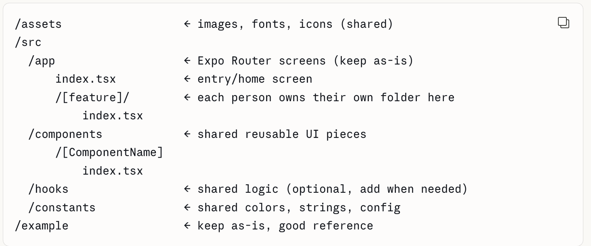
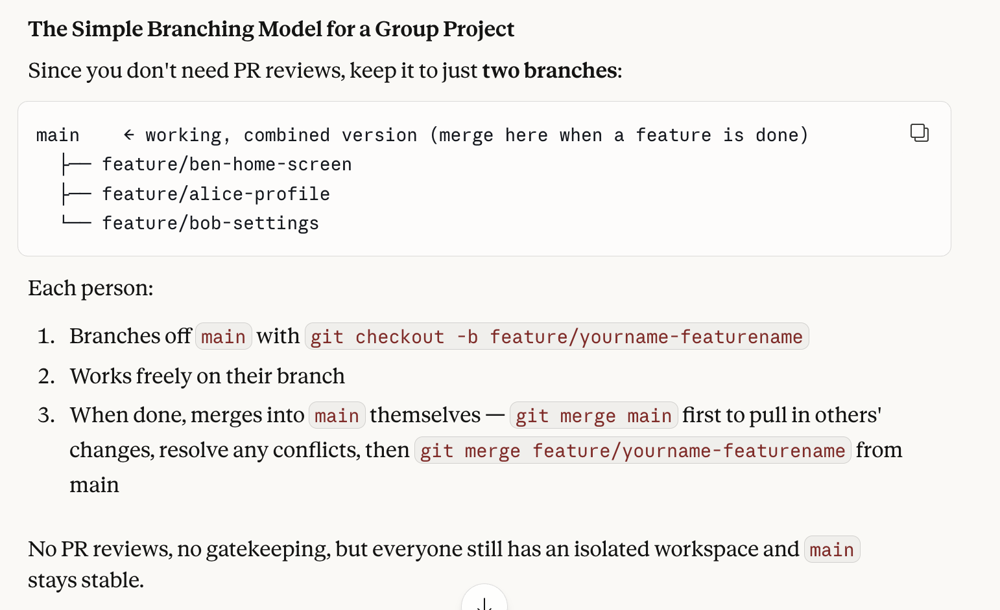

# Setting Up React Native

## Prerequisites: Install Node.js

- Download Node.js from [nodejs.org](https://nodejs.org/en/download). Standard setup options are fine.
- Open your terminal and type `node -v` to verify the installation.

---

## Step 1: Install Dependencies
```bash
npm install
```

---

## Step 2: Configure Android Studio

> PLEASE FOLLOW STEPS 1-4 ON THIS SITE! THE STUFF AFTER THIS MESSAGE ONLY SPECIFIES AFTER STEPS 1-4 ARE COMPLETED!!!! [official Expo setup guide](https://docs.expo.dev/get-started/set-up-your-environment/?platform=android&device=simulated).

### Phase 1: Find Your Android SDK Path

Before configuring your environment, you need to locate where Android Studio installed the SDK.

1. Open **Android Studio**.
2. On the welcome screen, click **More Actions** → **SDK Manager**.
   - *(If a project is already open: go to **Settings** → **Languages & Frameworks** → **Android SDK**)*
3. At the top of the window, locate the **Android SDK Location** field.
4. **Copy this path exactly.** You'll need it in the next steps.

**Default locations:**
| OS | Default Path |
|----|-------------|
| Windows | `C:\Users\YourName\AppData\Local\Android\Sdk` |
| macOS | `/Users/YourName/Library/Android/sdk` |

---

### Phase 2: macOS — Edit `.zshrc` or `.bash_profile`

1. Open **Terminal** and run the following to check your shell:
```bash
   echo $SHELL
```
   - `/bin/zsh` → edit `~/.zshrc`
   - `/bin/bash` → edit `~/.bash_profile`

2. Open the appropriate file:
```bash
   nano ~/.zshrc
```
   *(or `nano ~/.bash_profile`)*

3. Navigate to the **bottom of the file** and paste the following, replacing the path with your actual SDK path from Phase 1:
```bash
   export ANDROID_HOME=/Users/YourName/Library/Android/sdk
   export PATH=$PATH:$ANDROID_HOME/emulator
   export PATH=$PATH:$ANDROID_HOME/platform-tools
```

4. **Save and exit:**
   - Press `Control + O`, then `Enter` to save.
   - Press `Control + X` to exit.

5. Apply the changes:
```bash
   source ~/.zshrc
```
   *(or `source ~/.bash_profile`)*

---

### Phase 3: Windows — Set Environment Variables

1. Click the **Start Button**, type `env`, and select **Edit the system environment variables**.
2. In the window that appears, click **Environment Variables...** (bottom right).

**Part A — Create `ANDROID_HOME`:**
1. Under **User variables**, click **New...**
2. Set the following:
   - **Variable name:** `ANDROID_HOME`
   - **Variable value:** *(paste your SDK path from Phase 1)*
3. Click **OK**.

**Part B — Update `Path`:**
1. In **User variables**, find **Path** and click **Edit...**
2. Click **New** and add: `%ANDROID_HOME%\platform-tools`
3. Click **New** again and add: `%ANDROID_HOME%\emulator`
4. Click **OK** on all windows to close them.

> ⚠️ **Important:** Close and reopen any terminal windows for the changes to take effect.

---

### Phase 4: Android Studio Final Checklist

Even with correct paths, the emulator won't work unless the right tools are installed.

1. Open the **SDK Manager** in Android Studio.
2. Under the **SDK Platforms** tab, ensure the latest Android version (e.g., Android 14.0 or 15.0) is **checked**.
3. Under the **SDK Tools** tab, ensure these are **checked**:
   - ✅ Android SDK Build-Tools
   - ✅ Android Emulator
   - ✅ Android SDK Platform-Tools
4. Click **Apply** to install any missing items.

---

### Phase 5: Verify Your Setup

Run these commands to confirm everything is working:
```bash
adb --version
```
- ✅ **Success:** Displays `Android Debug Bridge version x.x.x`
- ❌ **Failure:** `command not found` — re-check your Path configuration.
```bash
emulator -list-avds
```
- ✅ **Success:** Lists your virtual devices (or returns blank if none created yet — no error is fine)
- ❌ **Failure:** Returns an error — re-check your Path configuration.

---

## Step 3: Start the App
```bash
npx expo start
```

> ⚠️ **Windows PowerShell Error:** If you see a red *"running scripts is disabled"* error, open a new PowerShell window **as Administrator**, run the command below, type `Y`, close it, and try again:
> ```powershell
> Set-ExecutionPolicy -ExecutionPolicy RemoteSigned -Scope CurrentUser
> ```

---

## Step 4: See It Live!

When you run `npx expo start`, a QR code will appear in your terminal.

- **Virtual Phone (Emulator):** If your Android emulator is already running, click inside the VS Code terminal and press the **`a`** key. The app will open automatically.

From there:
1. Open your project folder in **VS Code**.
2. Navigate to `app/index.tsx` or `App.js`.
3. Change some text and save — watch it update instantly!


Once you are developing, here is some helpful information:

